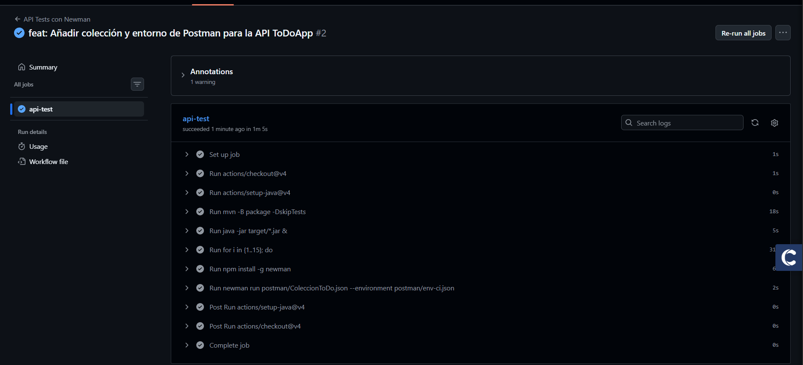

## Pruebas E2E (Selenium) y ejecución de colección Postman (Newman)

A continuación se explican los requisitos y pasos para ejecutar las pruebas end-to-end (Selenium) incluidas en el proyecto y cómo ejecutar la colección de Postman desde la línea de comandos con Newman. Al final hay indicaciones para guardar capturas de evidencia de los 3 checkpoints requeridos.

- Requisitos mínimos
  - Java 17 (el `pom.xml` está configurado para compilación con Java 17). Asegúrate de tener `java` en el PATH.
  - Maven 3.x
  - Google Chrome instalado en la máquina donde vayas a ejecutar las pruebas E2E. Las pruebas usan Chrome (en modo headless) y `WebDriverManager` descarga automáticamente el `chromedriver` compatible, pero el binario de Chrome/Chromium debe estar presente.
  - Node.js + npm (para ejecutar Newman). Instala Node desde https://nodejs.org/ si aún no lo tienes.

- Notas sobre versiones de Chrome / chromedriver
  - `webdrivermanager` (ya incluido como dependencia de test en el `pom.xml`) intenta descargar la versión correcta de `chromedriver`. Aun así, si tu entorno tiene una versión de Chrome muy antigua o muy nueva, puede ser necesario actualizar Chrome o fijar manualmente el `chromedriver`.
  - Para comprobar la versión de Chrome abre `chrome://version/` en el navegador.

- Ejecutar las pruebas E2E (Selenium) localmente
  - No es necesario arrancar la aplicación manualmente: la prueba usa `@SpringBootTest(webEnvironment = DEFINED_PORT)` y arranca la app en el puerto 8080 durante el test.
  - Asegúrate de que no haya otro proceso ocupando el puerto 8080.
  - Para ejecutar únicamente la prueba E2E:

```powershell
mvn -Dtest=e2e.TareasE2ETest test
```

  - Para ejecutar todas las pruebas (unitarias + integración + e2e):

```powershell
mvn clean test
```

  - Si quieres ver el navegador (no headless) para depurar la prueba, edita `src/test/java/e2e/TareasE2ETest.java` y elimina `--headless` de las opciones de Chrome (o comenta la línea). Recuerda volver a dejarlo en headless para ejecuciones automatizadas/CI.

- Ejecutar la colección de Postman con Newman (línea de comandos)
  - Instala Newman globalmente:

```powershell
npm install -g newman
```

  - Ejecuta la colección local usando el entorno `env-local.json` (usa `ToDoApp-Local` con `baseUrl = http://localhost:8080`):

```powershell
newman run postman/ColeccionToDo.json -e postman/env-local.json --reporters cli,html --reporter-html-export postman-report.html
```

  - El comando anterior generará un `postman-report.html` en el directorio actual y mostrará un resumen en la consola. Un resultado válido para evidencia es que `Failures: 0` o que el HTML muestre 0 fallos.

- Guardar evidencias (capturas) para los 3 checkpoints
  - 1) Selenium: "tests de Selenium en verde"
    - Ejecuta `mvn -Dtest=e2e.TareasE2ETest test` y guarda la salida de la consola donde aparece `Tests run: 1, Failures: 0`.
    - También puedes abrir el archivo de resultado en `target/surefire-reports/e2e.TareasE2ETest.txt` y tomar una captura.
    - Sugerencia de ruta para la captura: `docs/screenshots/e2e/selenium-passing.png` (créala y súbela al repositorio).

  - 2) Postman Runner / Newman: "Postman Runner con 0 failures"
    - Después de ejecutar el comando `newman` anterior, guarda la salida o el `postman-report.html` como evidencia.
    - Sugerencia de ruta para la captura: `docs/screenshots/postman/postman-runner-0fail.png` (créala y súbela al repositorio).

  - 3) GitHub Actions: "check verde"
    - Ya existe una captura de ejemplo en `docs/screenshots/post2/workflow-passing.png`.
    - Puedes actualizarla con la imagen de tu pipeline en GitHub Actions si lo deseas.

Ejemplo de cómo copiar el archivo de resultados de surefire (PowerShell):

```powershell
# después de ejecutar mvn
Copy-Item -Path .\target\surefire-reports\e2e.TareasE2ETest.txt -Destination .\docs\screenshots\e2e\e2e-result.txt -Force
```

Luego toma una captura de la ventana de la consola o del archivo `e2e-result.txt` y guarda la imagen en `docs/screenshots/e2e/selenium-passing.png`.

## Evidencias (capturas)


- GitHub Actions — workflow passing (ejemplo incluido):
  


